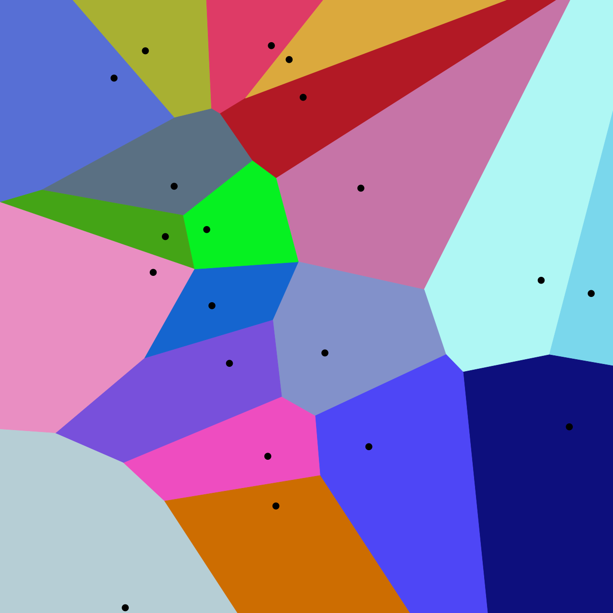
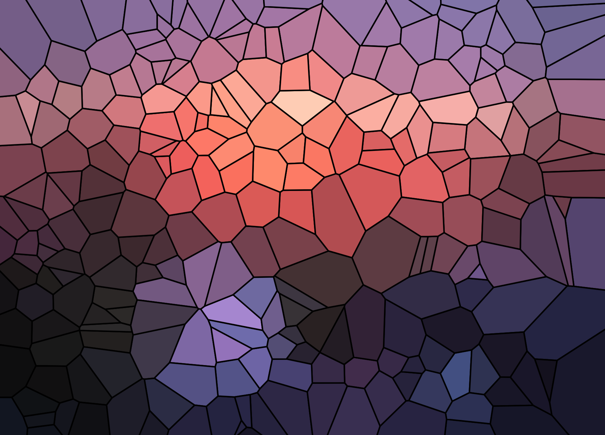
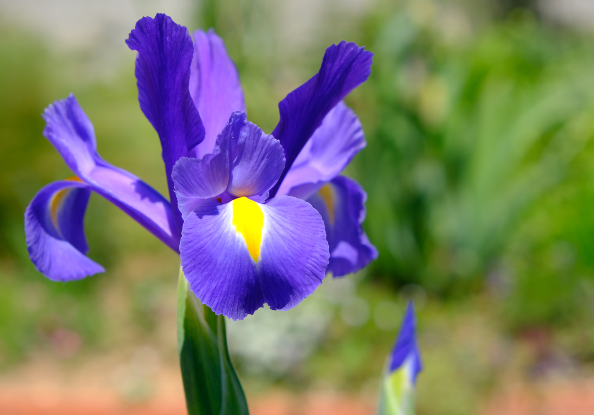
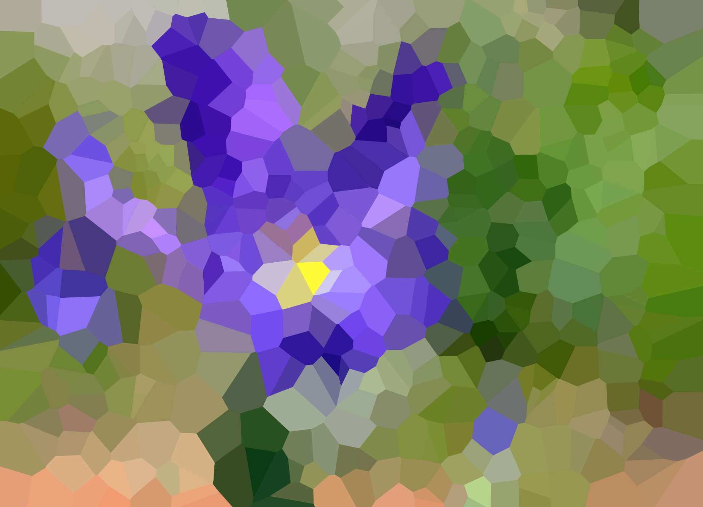
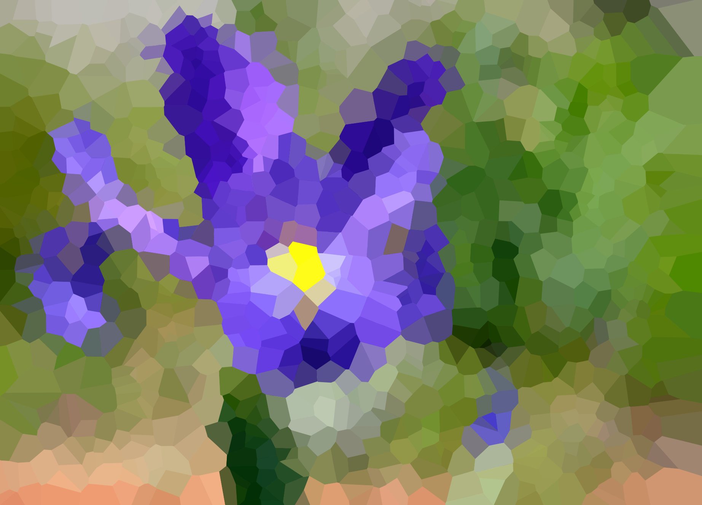
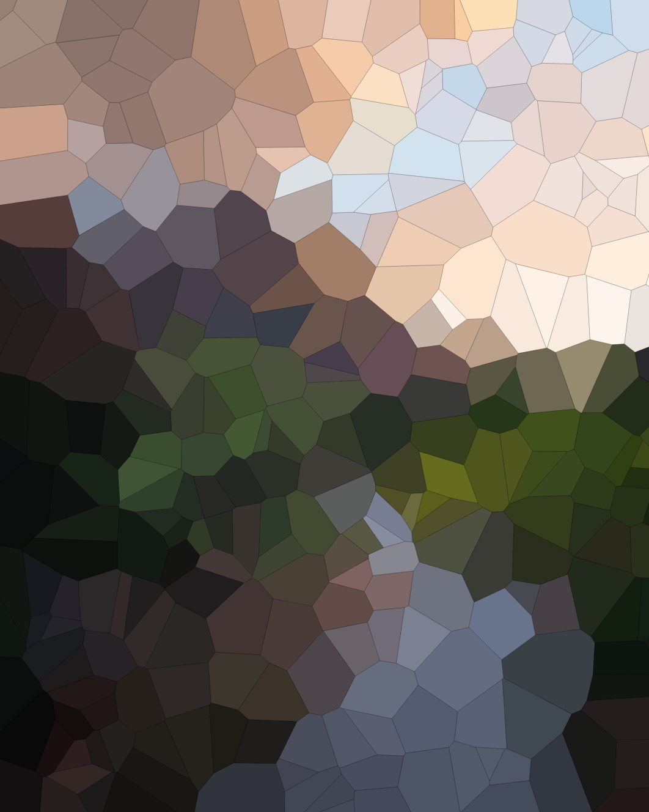

[//]: # (## blah blah)

[//]: # ()
[//]: # (_yay_)

[//]: # ()
[//]: # ([back]&#40;./&#41;)

# Description

This application provides a way for users to apply Voronoi diagrams in an artistic manner. The goal is to create a visually pleasing representation of an input image. Users can click on the canvas to create points, and this causes edges to appear and partition the plane into different regions. A checkbox can be clicked to toggle the visibility of the points in the diagram. Additionally, it's possible to upload an image as the background for the Voronoi diagram, which, with the right image, can have a nice effect. A "stained glass" effect can also be applied, which fills each cell with the average color of the image pixels within it.

[Video presentation describing this website](https://www.youtube.com/watch?v=bp0mO5FS_so)

## What are Voronoi diagrams?

The basic idea is that we have some points in a plane, and the diagram partitions the plane into different regions that are closest to each point. Here's one example of a Voronoi diagram, taken from Wikipedia:

[//]: # (![Voronoi Diagram]&#40;Euclidean_Voronoi_diagram_Custom.png&#41;)

[//]: # ()

[//]: # (center the image)

[//]: # ()


# Inputs and outputs

Your original image might look something like this:


After processing it, you may get something like this:




# Similar websites

There are some similar projects by other people that allow users to click to create Voronoi diagrams. One example is this website:

* [Standard Voronoi diagram generator](https://alexbeutel.com/webgl/voronoi.html)

Another example is this website. It also allows users to choose an image upon which to overlay the diagram. This website was my primary source of inspiration for implementing this Voronoi art generator.

* [Overlaying the diagram on top of an image](https://cfbrasz.github.io/Voronoi.html)


# Algorithm overview

My general algorithm is as follows:

1. A few initial points are generated on the page.
2. Users click on the canvas to create new points. Display of these points can be toggled on/off.
3. [D3.js](https://d3js.org/d3-delaunay/voronoi) is used to calculate the Voronoi diagram from these points. The diagram is displayed on the canvas.
4. Users may choose to upload a background image for the diagram. When this happens, all of the Voronoi cells become transparent so that the image can be seen.
5. After an image has been uploaded, users may choose to apply a "stained glass" effect, or color averaging algorithm, which fills each cell with the average colors of the image pixels contained within that cell.

### Color averaging algorithm

The colors of each individual cell are averaged as follows:

1. Keep a running total of RGB values and pixel count.
2. For each pixel in the image, do the following:
   1. Check if this pixel is inside the cell.
   2. If it is, then add its RGB values to the running total, and increment the count.
3. Average the RGB values using the pixel count
4. Set the cell's fill color 


Clearly, this is not the most efficient approach. A more sensible approach would be to constrain the search space, perhaps to the rectangular area around each cell.

Because this is an artistic application, it is not critical to have the most efficient algorithm possible. The output is well worth the 10-30 second wait. That said, I would like to implement a more efficient algorithm at some point in the future.

# More results

Here are some other results that can be obtained from processing images.

### Original:



Color averaging with 500 points, invisible lines:



Color averaging with 1000 points, invisible lines:




### Original:


Color averaging with 500 points, 0.1-thickness lines:




# Color averaging complexity analysis

Since the input images are resized and have a maximum width and height, the time complexity of this algorithm is technically linear in the number of points. It's still pretty bad, though.

[//]: # (If the size of the image was not constrained, then it would run in polynomial time &#40;O&#40;n^2&#41;&#41; )

### Some running times

These times were gathered from processing the original image in the "inputs and outputs" section, since its dimensions result in it being the maximum size.


[//]: # (* 100 points: 3.53 seconds)

[//]: # (* 250 points: 8.41 seconds)

[//]: # (* 500 points: 14.45 seconds)

[//]: # (* 1000 points: 30.51 seconds)


[//]: # (* **100** points: 3.53 seconds)

[//]: # (* **250** points: 8.41 seconds)

[//]: # (* **500** points: 14.45 seconds)

[//]: # (* **1000** points: 30.51 seconds)


* 100 points: **3.53** seconds
* 250 points: **8.41** seconds
* 500 points: **14.45** seconds
* 1000 points: **30.51** seconds


[//]: # (* **100** points: **3.53 seconds**)

[//]: # (* **250** points: **8.41 seconds**)

[//]: # (* **500** points: **14.45 seconds**)

[//]: # (* **1000** points: **30.51 seconds**)

---

## Main features:

* ~~Clicking to add points~~ (done!)
* ~~Point visibility toggle~~ (done!)
* ~~Image overlay option~~ (done!)
* ~~Color averaging per cell on the uploaded image~~ (done!)

[//]: # (#### All of these have been completed!)

## Stretch goals:

* **More efficient way to calculate the color averages**
* Button to add a certain number of points
* Toggle between preset numbers of points
* Toggle lines on/off
* Random point movement
* Show the color average for each cell as it's being computed
* Easy way to save the resulting image

[//]: # (I’ll also make it so the points can move around in a random manner, or be overlaid on top of an image. My idea is to create something resembling a screensaver that can be pleasing to look at.)

---


# References

* [Voronoi diagrams](https://en.wikipedia.org/wiki/Voronoi_diagram)
* [Standard Voronoi diagram generator](https://alexbeutel.com/webgl/voronoi.html)
* [Overlaying the diagram on top of an image](https://cfbrasz.github.io/Voronoi.html)
* [WebGL docs](https://developer.mozilla.org/en-US/docs/Web/API/WebGL_API)
* [D3.js Voronoi diagrams](https://d3js.org/d3-delaunay/voronoi)
* [Canvas API](https://developer.mozilla.org/en-US/docs/Web/API/Canvas_API)


[//]: # (---)


##### Project by Tycho Bear. Some website files sourced from the [Cayman](https://github.com/pages-themes/cayman) theme.


[//]: # (---)

[//]: # (Text can be **bold**, _italic_, or ~~strikethrough~~.)


[//]: # ([Link to another page]&#40;./about.html&#41;.)

[//]: # ()
[//]: # ()
[//]: # (There should be whitespace between paragraphs.)

[//]: # ()
[//]: # ()
[//]: # (There should be whitespace between paragraphs. We recommend including a README, or a file with information about your project.)

[//]: # ()
[//]: # ()
[//]: # (# Header 1)

[//]: # ()
[//]: # ()
[//]: # (This is a normal paragraph following a header. GitHub is a code hosting platform for version control and collaboration. It lets you and others work together on projects from anywhere.)

[//]: # ()
[//]: # ()
[//]: # (## Header 2)

[//]: # ()
[//]: # ()
[//]: # (> This is a blockquote following a header.)

[//]: # ()
[//]: # (>)

[//]: # ()
[//]: # (> When something is important enough, you do it even if the odds are not in your favor.)

[//]: # ()
[//]: # ()
[//]: # (### Header 3)

[//]: # ()
[//]: # ()
[//]: # (```js)

[//]: # ()
[//]: # (// Javascript code with syntax highlighting.)

[//]: # ()
[//]: # (var fun = function lang&#40;l&#41; {)

[//]: # ()
[//]: # (  dateformat.i18n = require&#40;'./lang/' + l&#41;)

[//]: # ()
[//]: # (  return true;)

[//]: # ()
[//]: # (})

[//]: # ()
[//]: # (```)

[//]: # ()
[//]: # ()
[//]: # (```ruby)

[//]: # ()
[//]: # (# Ruby code with syntax highlighting)

[//]: # ()


[//]: # ()
[//]: # (end)

[//]: # ()
[//]: # (```)

[//]: # ()
[//]: # ()
[//]: # (#### Header 4)

[//]: # ()
[//]: # ()
[//]: # (*   This is an unordered list following a header.)

[//]: # ()
[//]: # (*   This is an unordered list following a header.)

[//]: # ()
[//]: # (*   This is an unordered list following a header.)

[//]: # ()
[//]: # ()
[//]: # (##### Header 5)

[//]: # ()
[//]: # ()
[//]: # (1.  This is an ordered list following a header.)

[//]: # ()
[//]: # (2.  This is an ordered list following a header.)

[//]: # ()
[//]: # (3.  This is an ordered list following a header.)

[//]: # ()
[//]: # ()
[//]: # (###### Header 6)

[//]: # ()
[//]: # ([//]: # &#40;https://github.com/pages-themes/cayman/issues/82&#41;)
[//]: # ([//]: # &#40;that actually wasn't the issue, but I removed the lines between the&#41;)
[//]: # ()
[//]: # ([//]: # &#40;table rows and it fixed the problem&#41;)
[//]: # ()
[//]: # (| head1        | head two          | three |)
[//]: # (|:-------------|:------------------|:------|)
[//]: # (| ok           | good swedish fish | nice  |)
[//]: # (| out of stock | good and plenty   | nice  |)
[//]: # (| ok           | good `oreos`      | hmm   |)
[//]: # (| ok           | good `zoute` drop | yumm  |)

[//]: # ()
[//]: # ()
[//]: # (### There's a horizontal rule below this.)

[//]: # ()
[//]: # ()
[//]: # (* * *)

[//]: # ()
[//]: # ()
[//]: # (### Here is an unordered list:)

[//]: # ()
[//]: # ()
[//]: # (*   Item foo)

[//]: # ()
[//]: # (*   Item bar)

[//]: # ()
[//]: # (*   Item baz)

[//]: # ()
[//]: # (*   Item zip)

[//]: # ()
[//]: # ()
[//]: # (### And an ordered list:)

[//]: # ()
[//]: # ()
[//]: # (1.  Item one)

[//]: # ()
[//]: # (1.  Item two)

[//]: # ()
[//]: # (1.  Item three)

[//]: # ()
[//]: # (1.  Item four)

[//]: # ()
[//]: # ()
[//]: # (### And a nested list:)

[//]: # ()
[//]: # ()
[//]: # (- level 1 item)

[//]: # ()
[//]: # (  - level 2 item)

[//]: # ()
[//]: # (  - level 2 item)

[//]: # ()
[//]: # (    - level 3 item)

[//]: # ()
[//]: # (    - level 3 item)

[//]: # ()
[//]: # (- level 1 item)

[//]: # ()
[//]: # (  - level 2 item)

[//]: # ()
[//]: # (  - level 2 item)

[//]: # ()
[//]: # (  - level 2 item)

[//]: # ()
[//]: # (- level 1 item)

[//]: # ()
[//]: # (  - level 2 item)

[//]: # ()
[//]: # (  - level 2 item)

[//]: # ()
[//]: # (- level 1 item)

[//]: # ()
[//]: # ()
[//]: # (### Small image)

[//]: # ()
[//]: # ()
[//]: # (![Octocat]&#40;https://github.githubassets.com/images/icons/emoji/octocat.png&#41;)

[//]: # ()
[//]: # ()
[//]: # (### Large image)

[//]: # ()
[//]: # ()
[//]: # (![Branching]&#40;https://guides.github.com/activities/hello-world/branching.png&#41;)

[//]: # ()
[//]: # ()
[//]: # ()
[//]: # (### Definition lists can be used with HTML syntax.)

[//]: # ()
[//]: # ()
[//]: # (<dl>)

[//]: # ()
[//]: # (<dt>Name</dt>)

[//]: # ()
[//]: # (<dd>Godzilla</dd>)

[//]: # ()
[//]: # (<dt>Born</dt>)

[//]: # ()
[//]: # (<dd>1952</dd>)

[//]: # ()
[//]: # (<dt>Birthplace</dt>)

[//]: # ()
[//]: # (<dd>Japan</dd>)

[//]: # ()
[//]: # (<dt>Color</dt>)

[//]: # ()
[//]: # (<dd>Green</dd>)

[//]: # ()
[//]: # (</dl>)

[//]: # ()
[//]: # ()
[//]: # (```)

[//]: # ()
[//]: # (Long, single-line code blocks should not wrap. They should horizontally scroll if they are too long. This line should be long enough to demonstrate this.)

[//]: # ()
[//]: # (```)

[//]: # ()
[//]: # ()
[//]: # (```)

[//]: # ()
[//]: # (The final element.)

[//]: # ()
[//]: # (```)

